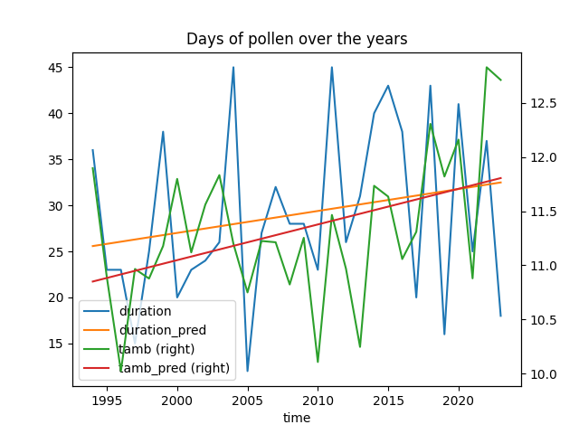
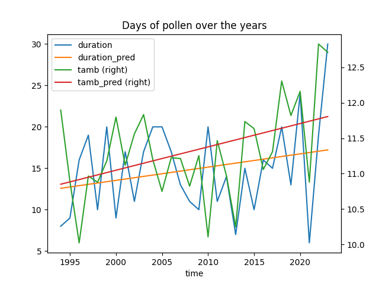
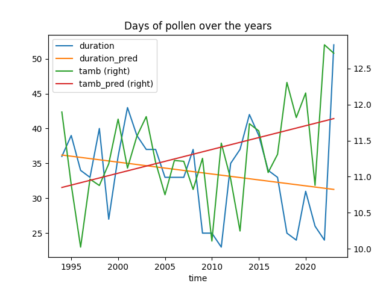

# Pollens

## Noisetiers

### Evolution du pollen depuis 1994 :


### Premier jour de pollen :

Plus grand que 0 (coef=-0.25) :


Plus grand que 10 (coef=-0.25) :


Plus grand que 70 (coef=-0.40) :


Plus grand que 250 (coef=-0.30) :


### Nombre de jours de pollen

Plus grand que 0 (coef=0.55) :


Plus grand que 10 (coef=0.24) :



Plus grand que 70 (coef=0.06) :


Plus grand que 250 (coef=0.17) :


### Date du pic max de pollen


### Moyenne de pollen et de temperature


## Bouleau

### Evolution du pollen depuis 1994 :


### Premier jour de pollen :

Plus grand que 0 (coef=-0.40) :


Plus grand que 10 (coef=0.00) :


Plus grand que 70 (coef=0.02) :


Plus grand que 300 (coef=-0.11) :


### Nombre de jours de pollen

Plus grand que 0 (coef=-0.07) :


Plus grand que 10 (coef=0.04) :


Plus grand que 70 (coef=0.16) :



Plus grand que 300 (coef=0.11) :


### Date du pic max de pollen


### Moyenne de pollen et de temperature


## Graminés

### Evolution du pollen depuis 1994 :


### Premier jour de pollen :

Plus grand que 0 (coef=-1.35) :


Plus grand que 20 (coef=0.06) :


Plus grand que 50 (coef=-0.09) :


Plus grand que 150 (coef=0.04) :


### Nombre de jours de pollen

Plus grand que 0 (coef=0.68) :


Plus grand que 20 (coef=0.25) :


Plus grand que 50 (coef=-0.17) :



Plus grand que 150 (coef=-0.06) :


### Date du pic max de pollen


### Moyenne de pollen et de temperature


pour compiler : ```pandoc resume.md -f markdown-implicit_figures -o test.pdf```