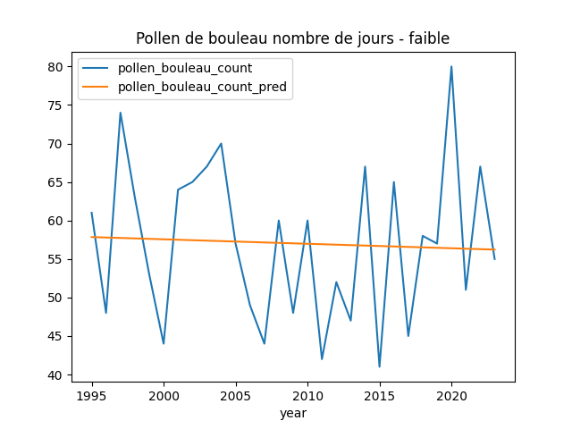
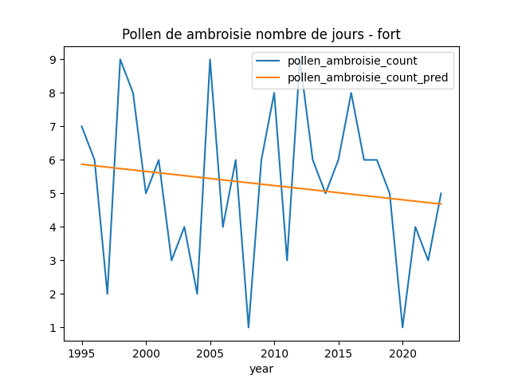

# Pollen Data stories

## Introduction

Cette data story vise à mettre en évidence l'évolution du pollen de 1994 à 2023.

Les mesures sont réalisées en pollen par mètres cubes.

## Plantes observées

Nous avons choisi d'observer 3 plantes très allergisantes. Le `bouleau`, l'`ambroisie`, et les `graminées`. Comme nous pouvons le voir sur le schéma suivant, ces trois espèces appartiennent à la clade des angiospermes. Puis les `graminées` se détachent des deux autres et le `bouleau` et l'`ambroisie` sont quant à eux plus proches et appartiennent à la clade des `dicotylédones`.

Il est important de relevé ces liens, car comme nous allons le voir les plantes réagissent différemment en fonction de leur espèce.

# Pollen sur l'année - Données

## Moyenne

## Maximum

## Nombre de jours de pollen

### Faible intensité

### Moyenne intensité

### Forte intensité

### Très forte intensité

## Premier jour de pollen

### Faible intensité

### Moyenne intensité

### Forte intensité

### Très forte intensité

# Pollen sur l'année - Analyse

La quantité de pollen détectée en une journée peut-être classée dans une des quatres catégories suvantes : `faible, moyen, fort, très fort`. Ces seuils sont différents en fonction de la plante, et sont tirés du site <https://www.pollenundallergie.ch/informations-polliniques/donnees-polliniques/retrospective-annuelle-pollens>. Grâce à cette classification simplifiée, nous pouvons comparer de manière plus intuitive les différents pollens étudiés.

|         |faible|moyen  |fort    |très fort|
|---------|------|-------|--------|---------|
|Ambroisie|1 - 6 |6 - 11 |11 - 40 |>40      |
|Bouleau  |1 - 10|10 - 70|70 - 300|>300     |
|Graminées|1 - 20|20 - 50|50 - 150|>150     |

## Moyenne

La moyenne est réalisée sur les jours de l'années contenant du pollen.

En observant l'`Ambroisie`, nous voyons que la moyenne des pollens de chaque années indiquent une tendance à diminuer. Avec des valeurs oscillant entre une quantité de pollen faible, moyenne, et forte, nous voyons que la moyenne des dernières années a tendance à être contenue dans des mesures faibles et moyennes.

En opposition, le pollen du `Bouleau` indique une très forte augmentation de la moyenne au fil des années. Avec des mesures oscillant entre une intensité de pollen moyenne et forte, celle-ci semble atteindre des pics de plus en plus élevés suivis de quelques années plus calmes.

Finalement, le pollen des `Graminées` démontre une diminution de la moyenne assez importante. L'intensité du pollen reste contenue dans la catégorie moyenne et oscille peu.

Ces tendances peuvent être expliqués de deux manières. La première pourrait être tout simplement que la quantité de pollen entre deux années diminue / augmente pour un même nombre de jours de pollen. La seconde peut être liée au nombres de jours où du pollen est présent. Avec des jours supplémentaires par année où du pollen est présent mais en plus faibles / grandes quantitées, nous pourrions observer le même phénomène. Finalement, il est possible qu'un mélange de ces deux comportement soit la source des comportements relevés.

Il est donc nécessaire d'ênqueter sur la source de ces observations, en relevant l'évolution des valeurs maximums détectées par années, mais aussi le nombre de jours de pollen.

## Maximum

En nous intéressant à la valeur maximum répertoriée en une journée pour chaque années entre 1994 et 2023, nous pouvons voir que l'`Ambroisie` demontre une tendance à augmenter de manière modérée avec certains pics atteignant des valeurs deux fois plus élevée que la moyenne. Cela contraste avec l'effet observé des valeurs moyennes. Il est donc nécessaire d'étudier l'évolution du nombre de jours de pollen.

Le `Bouleau` demontre quant à lui une augmentation du pollen maximum plus importante, avec des pics atteignant également des valeurs deux fois plus élevées que la moyenne. Cela confirme la tendance observée précédemment avec la moyenne.

La valeur maximum des `Graminées` au fil des années diminue bien que certains pics atteignent des valeurs jusqu'à deux fois plus élevées que la moyenne. Cependant, il n'en demeure pas moins qu'il reste une tendance à ce que la quantité de pollen maximum diminue. Cela nous conforte dans le comportement de la moyenne.

## Nombre de jours de pollen

Nous allons à présent étudier l'évolution du nombre de jours de pollen d'une saison pollinique au fil des années. Pour cela nous allons prendre en compte les catégories précédemment établies et compter les jours où les valeurs de pollen détectées sont supérieures ou égales au minimum de la catégorie.

Concernant l'`Ambroisie`, comme attendu suite au comportement de la moyenne et du maximum, nous pouvons voir que le nombre de jours où le pollen est au moins `faible` augmente fortement, l'intensité du pollen `moyen` augmente légérement, et finalement les intensités `fortes` et `très fortes` démontrent une tendance à diminuer. Avec un nombre de jours de pollen `fort` ou `très fort` diminuant au fil des années, et des jours de pollen `faible` ou `moyen` qui augmentent, il parait logique que la moyenne diminue au fil des années. Cela signifie que malgré des épisodes pollinique moins forts, le pollen de l'`Ambroisie` est présent plus de jours au cours d'une année.

Le `Bouleau` indique que le nombre de jours de pollen `faible` ou supérieur a tendance à diminuer tandis que les intensités `moyennes`, `fortes`, et `très fortes` augmentent. Parmis celles-ci les catégories `forts` et `très forts` augmentent plus fortement. Ainsi non même si le nombre de jours totaux de pollen diminuent légérement, le nombre de jours où celui-ci est intense augmente. De plus, non seulement ces derniers augmentent, mais les valeurs maximales atteintes augmentent également.

Les `Graminées` nous indiquent que le nombre de jours où du pollen en `faible` quantité est présent augmente fortement au fil des années. En revanche, les catégories plus intenses démontrent quand à elle une baisse importante. Il semblerait donc que le pollen des graminées bien qu'ayant tendance à durer plus longtemps est quant à lui de moins en moins intense au fil des années.

## Premier jour de pollen

Pour aller plus loin dans l'analyse des pollens, nous avons également fait ressortir le premier jour de pollen afin d'observer si celui-ci reste constant ou non à travers les années. Un point complexe a été de déterminer les périodes de pollen de chaque plante. Pour cela nous nous sommes basés sur le calendrier pollinique suivant : <https://www.meteosuisse.admin.ch/portrait/meteosuisse-blog/fr/2022/12/calendrier-pollinique.html>. Puis nous avons sélectionné arbitrairement les dates qui nous paraissaient être les meilleures pour découper deux saisons polliniques. Ainsi, nous obtenons le résultat suivant :

- `Ambroisie` : 30 avril au 29 avril
- `Bouleau` : 30 septembre au 29 septembre
- `Graminées` : 31 janvier au 30 janvier

La complexité réside dans le fait que certains pollens peuvent être détecté en très faible quantitée à des périodes où ils ne sont pas censé être actifs. Cela rend donc l'analyse des résultats pour l'intensité `faible` moins robuste.
Nous avons également repris la structure des catégories pour analyser les différents premier jours de chaque intensité. L'axe `y` correspond toujours aux années, cependant l'axe `x` indique le nombre de jours à partir de la date ci-dessus avant que du pollen ait été détecté.

### Faible intensité

Ainsi en ne prenant en compte que les premiers jours à partir desquels du pollen est détecté même en faible quantité, les trois plantes affichent que leur premier jours est de plus en plus tôt. Parmis ceux-ci, les graminées sont ceux dont le premier jour de pollen a considérablement reculé, ce qui parait cohérent avec le nombre de jour de pollen qui a augmenté.

### Moyenne intensité

L'`Ambroisie` et les `Graminées` démontrent un comportement similaire pour une intensité moyenne avec un léger recul du premier jour. En revanche, le `Bouleau` démontre un léger avancement du premier jour de la même catégorie.

### Forte intensité

Au niveau de l'`Ambroisie`, l'intensité forte démontre tout comme l'intensité moyenne un léger recul. Le `Bouleau` conserve un comportement similaire avec un léger avancement du premier jour. Et finalement les `Graminées`, malgré des variations, restent stable au fil des années.

### Très forte intensité

Finalement, pour une intensité très forte l'`Ambroisie` démontre un très léger avancement, le `Bouleau` un léger avancement, et finalement les `Graminées` gardent un comportement similaire à la catégorie `forte` c'est-à-dire stable.

## Conclusion

Comme nous avons pu le voir, le pollen des trois plantes se comporte différemment malgré la proximité de leurs espèces.

L'`Ambroisie` démontre en moyenne une diminution du pollen à travers les années, mais une augmentation des maximums atteints. Cela s'explique par le fait que le nombre de jour des pollens d'intensité `faible` et `moyenne` augmentent alors que les intensités supérieures diminuent. De plus, le premier jour de pollen apparait de plus en plus en tôt. Il en résulte des années en moyenne plus faible, mais pour lesquelles la présence de pollen est plus longue dû à un début de ces derniers plus tôt.

Le pollen du `Bouleau` augmente en moyenne de manière très importante. Les valeurs maximales atteintes affichent une forte tendance à augmenter. Le nombre de jours de pollen d'intensité `faible`est relativement stable bien que diminuant légérement, cependant les catégories plus fortes indiquent une légère augmentation. Par ailleurs, le premier jour de pollen débute de plus en plus tôt. De manière générale, le pollen du `Bouleau` affiche une durée plus élevée pour des concentration de pollen suivant cette tendance, avec un démarrage de la saison pollinique précoce au désarroi des personnes allergiques.

Les `Graminées` à l'inverse du `Bouleau` affichent une diminution de la moyenne des pollen au fil des années. Les maximums atteints sont également en baisse tandis que le nombre de jours de pollen d'une intensité `faible` augmentent. Les intensités `moyennes`, `fortes`, et `très fortes` sont en revanche en diminition. Le premier jour de pollen arrive également plus tôt pour la catégorie `faible` mais plus tard pour la catégorie `moyenne`, les autres quant à elles restent stables. Le pollen des `Graminées` indique une tendance à devenir de plus en plus faible tant au niveau de la moyenne et des valeurs maximum atteintes alors que le nombre de jours d'une faible quantité de pollen sont en augmentation tout en débutant plus tôt.